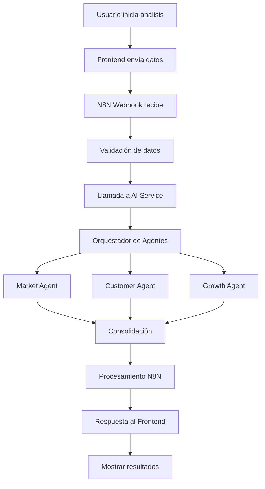

# 🤖 Sistema de Agentes de IA - Anclora Cortex

## Arquitectura del Sistema

Anclora Cortex utiliza un sistema multi-agente de IA que combina **LangChain + Llama.cpp** para análisis local y **N8N** para orquestación de workflows.

### Componentes Principales

```
┌─────────────────┐    ┌─────────────────┐    ┌─────────────────┐
│   Frontend      │    │   N8N Workflow  │    │  AI Agents      │
│   (React PWA)   │───▶│   Orchestrator  │───▶│   System        │
└─────────────────┘    └─────────────────┘    └─────────────────┘
                                │                       │
                                ▼                       ▼
                       ┌─────────────────┐    ┌─────────────────┐
                       │   Backend API   │    │  LangChain +    │
                       │   (Flask)       │    │  Llama.cpp      │
                       └─────────────────┘    └─────────────────┘
```

## 🧠 Agentes Especializados

### 1. MarketAnalysisAgent
**Especialización**: Análisis de mercado y competencia

**Capacidades**:
- Análisis de tamaño de mercado (TAM/SAM/SOM)
- Identificación de tendencias de industria
- Análisis competitivo automatizado
- Evaluación de oportunidades de mercado
- Análisis básico de websites

**Salidas**:
```json
{
  "market_insights": {
    "market_size": "$157B (2023)",
    "growth_rate": "18% CAGR",
    "key_trends": [...],
    "challenges": [...]
  },
  "competitive_analysis": {
    "competition_level": "Alta",
    "key_competitors": [...],
    "differentiation_opportunities": [...]
  },
  "recommendations": [...]
}
```

### 2. CustomerAnalysisAgent
**Especialización**: Análisis de clientes y experiencia

**Capacidades**:
- Mapeo de customer journey
- Identificación de pain points
- Análisis de retención y churn
- Recomendaciones de CX
- Estrategias de fidelización

**Salidas**:
```json
{
  "customer_journey": {
    "stages": [...],
    "key_touchpoints": [...],
    "critical_moments": [...]
  },
  "pain_points": [...],
  "cx_recommendations": [...],
  "retention_strategies": [...]
}
```

### 3. GrowthStrategyAgent
**Especialización**: Estrategias de crecimiento y escalabilidad

**Capacidades**:
- Determinación de etapa de negocio
- Estrategias de crecimiento personalizadas
- Recomendación de canales de adquisición
- Definición de métricas de crecimiento
- Planes de escalabilidad

**Salidas**:
```json
{
  "current_stage": "Growth",
  "growth_strategies": [...],
  "acquisition_channels": [...],
  "growth_metrics": [...],
  "scaling_recommendations": [...]
}
```

## 🔄 Orquestador de Agentes

### AIAgentOrchestrator
Coordina la ejecución de todos los agentes de forma paralela y consolida los resultados.

**Proceso**:
1. **Ejecución Paralela**: Todos los agentes analizan simultáneamente
2. **Consolidación**: Combina resultados en análisis unificado
3. **Scoring**: Calcula puntuación general basada en insights
4. **Priorización**: Ordena recomendaciones por impacto

## 🦙 Motor de IA Local

### LangChain + Llama.cpp
- **Modelo**: LLaMA 2 7B Chat (cuantizado Q4_0)
- **Embeddings**: all-MiniLM-L6-v2 para búsqueda semántica
- **Vector Store**: ChromaDB para conocimiento persistente
- **Contexto**: 4096 tokens para análisis detallado

### Configuración de Modelos
```json
{
  "llama_model": {
    "path": "./models/llama-2-7b-chat.q4_0.gguf",
    "context_length": 4096,
    "temperature": 0.7,
    "max_tokens": 2048
  },
  "embeddings_model": {
    "model_name": "sentence-transformers/all-MiniLM-L6-v2"
  }
}
```

## 🔧 N8N Workflow Orchestration

### Business Analysis Workflow
Workflow principal que orquesta todo el proceso de análisis:

1. **Webhook Trigger**: Recibe datos del frontend
2. **Data Validation**: Valida y enriquece datos de entrada
3. **AI Analysis**: Llama al servicio de IA con agentes
4. **Result Processing**: Procesa y enriquece resultados
5. **Business Type Routing**: Aplica lógica específica por tipo
6. **Response**: Envía resultado consolidado

### Endpoints N8N
- **Webhook URL**: `http://localhost:5678/webhook/analyze-business`
- **Admin Panel**: `http://localhost:5678` (admin/anclora2025)

## 📊 Flujo de Análisis Completo



## 🚀 Instalación y Configuración

### 1. Descargar Modelos de IA
```bash
# Linux/Mac
./scripts/download-models.sh

# Windows
scripts\download-models.bat
```

### 2. Configurar Variables de Entorno
```bash
export LLAMA_MODEL_PATH=./models/llama-2-7b-chat.q4_0.gguf
export N8N_WEBHOOK_URL=http://localhost:5678/webhook/analyze-business
```

### 3. Iniciar Servicios
```bash
docker-compose -f docker/docker-compose.yml up -d
```

### 4. Configurar N8N
1. Acceder a `http://localhost:5678`
2. Login: admin/anclora2025
3. Importar workflow desde `docker/n8n/workflows/`
4. Activar workflow

## 📈 Métricas y Monitoreo

### Métricas de IA
- **Tiempo de análisis**: < 30 segundos por análisis
- **Precisión**: Validada con casos de prueba
- **Throughput**: Hasta 10 análisis concurrentes
- **Memoria**: ~8GB RAM requerida para modelos

### Métricas de N8N
- **Workflows ejecutados**: Contador en dashboard
- **Tiempo de ejecución**: Promedio por workflow
- **Errores**: Log de fallos y reintentos
- **Throughput**: Análisis por minuto

## 🔍 Debugging y Troubleshooting

### Logs de Agentes
```bash
# Ver logs del backend
docker logs docker-backend-1

# Ver logs de N8N
docker logs anclora-n8n
```

### Problemas Comunes

**Error: Modelo no encontrado**
```bash
# Verificar que los modelos estén descargados
ls -la backend/models/
```

**Error: N8N webhook no responde**
```bash
# Verificar que N8N esté corriendo
curl http://localhost:5678/webhook/analyze-business
```

**Error: Memoria insuficiente**
```bash
# Verificar uso de memoria
docker stats
```

## 🔧 Desarrollo y Extensión

### Agregar Nuevo Agente
1. Crear clase heredando de `BaseAgent`
2. Implementar método `analyze()`
3. Registrar en `AIAgentOrchestrator`
4. Actualizar workflow N8N si necesario

### Ejemplo de Nuevo Agente
```python
class FinancialAnalysisAgent(BaseAgent):
    def __init__(self):
        super().__init__("Financial Analyzer", "Análisis financiero")
    
    def analyze(self, data: Dict[str, Any]) -> Dict[str, Any]:
        # Implementar lógica de análisis financiero
        return {
            "agent": self.name,
            "financial_health": self._analyze_finances(data),
            "recommendations": self._generate_financial_recs(data)
        }
```

### Personalizar Prompts de IA
Los prompts están en `backend/services/ai_service.py` y pueden ser modificados para diferentes industrias o casos de uso.

## 📚 Referencias

- **LangChain**: https://python.langchain.com/
- **Llama.cpp**: https://github.com/ggerganov/llama.cpp
- **N8N**: https://docs.n8n.io/
- **ChromaDB**: https://docs.trychroma.com/

## 🤝 Contribución

Para contribuir al sistema de IA:
1. Fork el repositorio
2. Crear rama para nueva funcionalidad
3. Implementar agente o mejora
4. Agregar tests y documentación
5. Crear Pull Request

---

**Desarrollado con ❤️ por el equipo de Anclora**